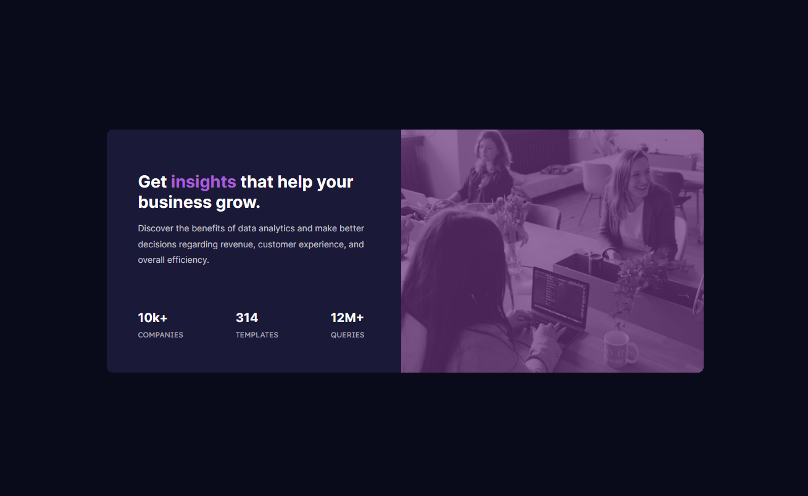

# Frontend Mentor - Stats preview card component solution

This is a solution to the [Stats preview card component challenge on Frontend Mentor](https://www.frontendmentor.io/challenges/stats-preview-card-component-8JqbgoU62). Frontend Mentor challenges help you improve your coding skills by building realistic projects. 

## Table of contents

- [Overview](#overview)
  - [The challenge](#the-challenge)
  - [Screenshot](#screenshot)
  - [Links](#links)
- [My process](#my-process)
  - [Built with](#built-with)
  - [What I learned](#what-i-learned)
- [Author](#author)
- [Acknowledgments](#acknowledgments)

**Note: Delete this note and update the table of contents based on what sections you keep.**

## Overview

### The challenge

Users should be able to:

- View the optimal layout depending on their device's screen size

### Screenshot

### Links

- Solution URL: [Add solution URL here](https://your-solution-url.com)
- Live Site URL: [Add live site URL here](https://your-live-site-url.com)

## My process
- I started with the mobile design first. I tested out the layout using divs with background colors first.
- I then inserted the content into the divs. I used CSS Grid for the image and text containers so that they resized accordingly with the screen size.
- I then started working on the desktop design. Using Grid made it easy to change the layout of the containers. I still had to go back and forth a few times to get the spacing of items correct.

### Built with

- Semantic HTML5 markup
- Flexbox
- CSS Grid
- Mobile-first workflow

### What I learned

- It was my first time trying out mobile-first workflow. I gained a lot of experience from this and understood the importance of media queries.
- I also gained experience in using CSS Grid.
- I learnt about using background images more. 

## Author

- Frontend Mentor - [@riverCodes](https://www.frontendmentor.io/profile/riverCodes)

## Acknowledgments

Thanks to frontend mentor as always.
